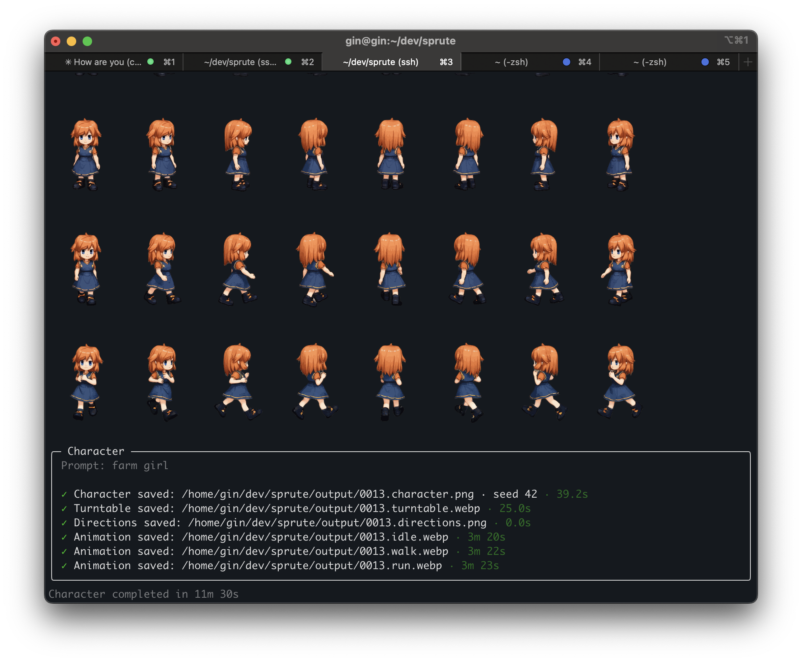
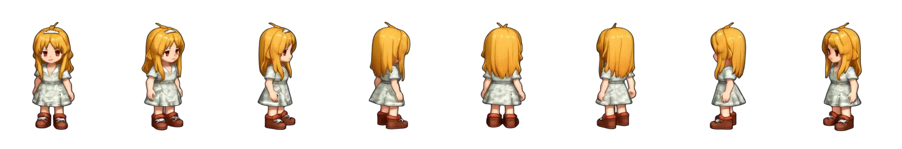
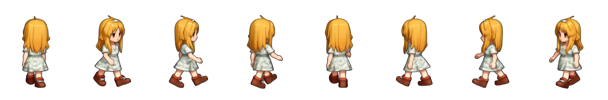
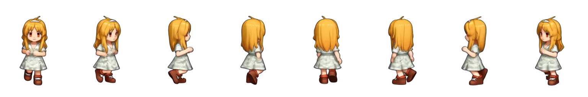

# Sprute

*Sprute* is an open-source CLI tool that generates animated, 8-directional character sprites from a text prompt or a character image, running locally on your GPU.



Think of it as a Giga Press for character sprites: feed in a prompt, and Sprute stamps out the character in eight directions, animated idle, walk, and run.

## Example

One character, eight directions, three motions:

`idle`<br>


`walk`<br>


`run`<br>


## Getting Started

Requires Python 3.12+ and a GPU (tested on NVIDIA CUDA).

### 1. Install

```bash
uv venv
source .venv/bin/activate
uv pip install -e .
```

### 2. Point Sprute at your models (optional)

Without this, `sprute setup` downloads models into `./models`.

To reuse an existing ComfyUI models folder instead, create `sprute.config.json` in the directory you run Sprute from:

```json
{
  "models_directory": "/path/to/ComfyUI/models"
}
```

`--models-directory` on any command overrides the config.

### 3. Set up

```bash
sprute setup
```

This installs ComfyUI and its custom nodes, downloads the models, and checks that your GPU works.

The models take about 108 GB. Any that are already in the models directory are reused, not downloaded again.

### 4. Make a character

```bash
sprute character "a knight in silver armor"

# Start from your own character image instead
sprute character --image hero.png
```

This runs every step below: generate, eight directions, and the `idle`, `walk`, and `run` animations. `--presets idle,run` picks which animations, and `--seed` is used for every step. The rest of this section covers each step on its own.

### 5. Generate a character

```bash
# Random character
sprute character-generate

# From a text prompt
sprute character-generate "a girl wearing a dress"

# Named, with a fixed seed
sprute character-generate "a knight" --name knight --seed 42
```

Characters are saved as `output/<name>.character.png`, numbered `0001`, `0002`, … when no name is given.

### 6. Generate eight directions

```bash
sprute character-turntable output/0001.character.png
```

This saves:

- `0001.turntable.webp`: the rotating turntable animation
- `0001.directions.png`: a strip of the eight directions (1536×256)
- `0001.directions.webp`: the eight directions as an animation

Directions are always ordered S, SE, E, NE, N, NW, W, SW (counter-clockwise from south), in both the strip and the animations.

Running it again overwrites these files. With the same `--seed` and the same input image, Sprute returns the existing files instead of rerunning.

### 7. Animate

```bash
sprute character-animate output/0001.directions.png --preset run
```

Presets are `idle`, `walk`, and `run`. This saves `0001.run.webp`: an animated strip with all eight directions side by side (1536×256, 81 frames).

As with turntable, the same `--seed` and input return the existing file instead of rerunning.

### Preview

```bash
sprute preview output/0001.run.webp
```

Shows an output in iTerm2. Animated WebP files play in place.

## Why Sprute?

Making sprite animations is hard. Hard enough that creators often stop themselves from adding more animation states, more characters, more NPCs, or more enemies simply because of the amount of work involved.

For world builders and wild imaginators, that cost becomes a real creative constraint.

You draw a beautiful RPG map, imagine towns full of people, enemies roaming the wilderness, and characters living out their own routines—then realize you don't actually have the time or resources to populate that world and make it feel alive.

Sprute tries to remove that bottleneck.

Given a single prompt or reference image, Sprute aims to create a complete animated character end to end, so you can spend less time manufacturing sprites and more time building the living world you imagined.

## Is it Free?

Yes. Sprute is free and open source, and it runs entirely on your own GPU, so there are no API keys or inference costs.

Alternate workflows in [`workflows/alts`](workflows/alts) can be opened in ComfyUI directly. Some of them use API nodes, which need a ComfyUI account and are billed by the provider.

## License

Sprute is licensed under the [MIT License](LICENSE).

Sprute does not claim ownership of the sprites or animations you generate, and does not require attribution or royalties for those outputs.

You may use generated assets in personal or commercial projects, subject to the terms of the models and services used and any rights associated with your reference images. 