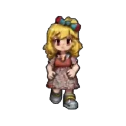
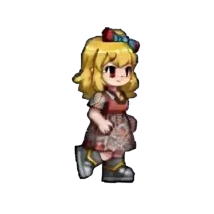
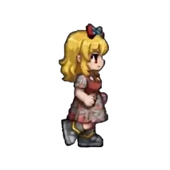
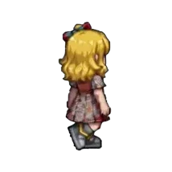
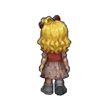

# Sprute

[TODO: hero flow chart ] 

Sprute is an open-source CLI tool for generating animated, 8-directional character sprites from a single reference image using template-guided image and video models.

Think of it as a Giga Press for character sprites: feed in one character image, and Sprute stamps out a complete set of animated directional sprites.

<table style="text-align: center;">
<tr>
<td style="border:none;">
⬇️
</td>
<td style="border:none;">
↘️
</td>
<td style="border:none;">
➡️
</td>
<td style="border:none;">
↗️
</td>
<td style="border:none;">
⬆️
</td>
</tr>
</table>

## How to use

## Why?

Making sprite animations is hard. Hard enough that creators often stop themselves from adding more animation states, more characters, more NPCs, or more enemies simply because of the amount of work involved.

For world builders and wild imaginators, that cost becomes a real creative constraint.

You draw a beautiful RPG map, imagine towns full of people, enemies roaming the wilderness, and characters living out their own routines—then realize you don't actually have the time or resources to populate that world and make it feel alive.

Sprute tries to remove that bottleneck.

Given a single prompt or reference image, Sprute aims to create a complete animated character end to end, so you can spend less time manufacturing sprites and more time building the living world you imagined.

