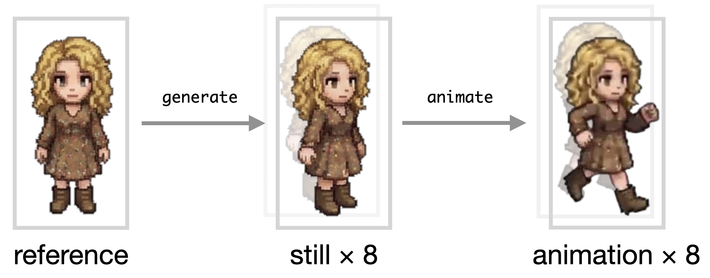
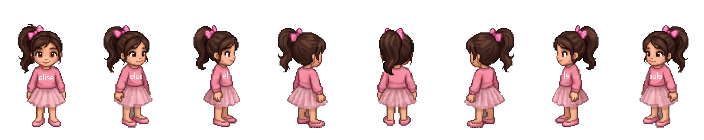
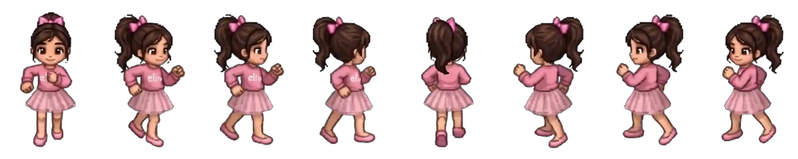

# Sprute

*Sprute* is an open-source CLI tool for generating animated, 8-directional character sprites from a single reference image using template-guided image and video models.



Think of it as a Giga Press for character sprites: feed in one character image, and Sprute stamps out a complete set of animated directional sprites.

## Getting Started

### Prerequisite

[TODO: How to configure Replicate API Key]

### Generating Character Stills

The easiest way to get started is to use our CLI tool.

To generate 8-directional character, use `generate character`:
```bash
# Generate a random 8-dir character
npx sprute generate character

# From a text prompt
npx sprute generate character --prompt "a girl wearing a dress"

# From a reference image
npx sprute generate character --image ./reference.png

# Specify output path
npx sprute generate character --output ./output/hero
```

The resulting 8-dir character will be saved in output directory (default: current directory). 

**Example Output**:
<table>
<tr><td>Input</td><td>Result</td></tr>
<tr><td align="center">

</td><td align="center">
<code>npx sprute generate character --image ./reference.png</code><br />

</td></tr>
</table>

### Animating Characters

Once 8-directional character stills are generated, you can feed it into `animate character` to animate them.

```bash
# Generate run animation
npx sprute animate character --character ./output/hero --preset run

# Generate idle animation
npx sprute animate character --character ./output/hero --preset idle
```

<table>
<tr><td align="center">Input</td><td></td></tr>
<tr><td align="center"><code>idle</code></td><td align="center"><code>npx sprute animate character --character ./output/hero --preset idle</code><br />[TODO]</td></tr>
<tr><td align="center"><code>walk</code></td><td align="center"><code>npx sprute animate character --character ./output/hero --preset walk</code><br />[TODO]</td></tr>
<tr><td align="center"><code>run</code></td><td align="center"><code>npx sprute animate character --character ./output/hero --preset run</code><br /></td></tr>
</table>

## Why?

Making sprite animations is hard. Hard enough that creators often stop themselves from adding more animation states, more characters, more NPCs, or more enemies simply because of the amount of work involved.

For world builders and wild imaginators, that cost becomes a real creative constraint.

You draw a beautiful RPG map, imagine towns full of people, enemies roaming the wilderness, and characters living out their own routines—then realize you don't actually have the time or resources to populate that world and make it feel alive.

Sprute tries to remove that bottleneck.

Given a single prompt or reference image, Sprute aims to create a complete animated character end to end, so you can spend less time manufacturing sprites and more time building the living world you imagined.

## Is it Free?

The Sprute CLI itself is free and open source, but some parts of the pipeline use close-source cloud models for inference.

To use those models, you'll need to provide a Replicate API key (read in *Getting Started*). Any inference costs are billed through your own Replicate account.

As of version 2.0, the expected cost of generating *idle* plus *run* animation is around $0.70 (70 cents).

I hope to offer a fully local workflow in the future, so you can run the entire pipeline on your own hardware.

## License

Sprute is licensed under the [MIT License](LICENSE).

Sprute does not claim ownership of the sprites or animations you generate, and does not require attribution or royalties for those outputs.

You may use generated assets in personal or commercial projects, subject to the terms of the models and services used and any rights associated with your reference images. 